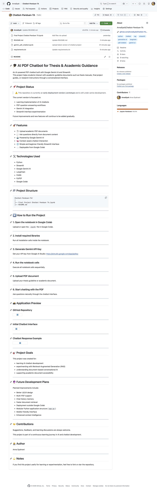
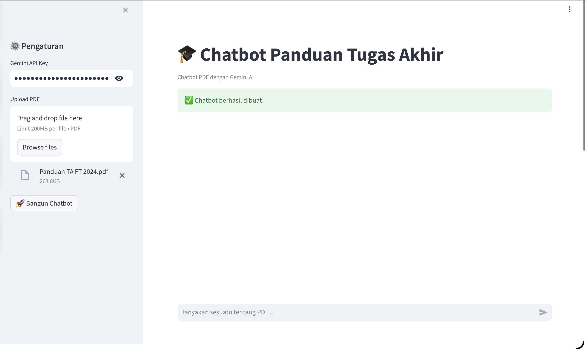
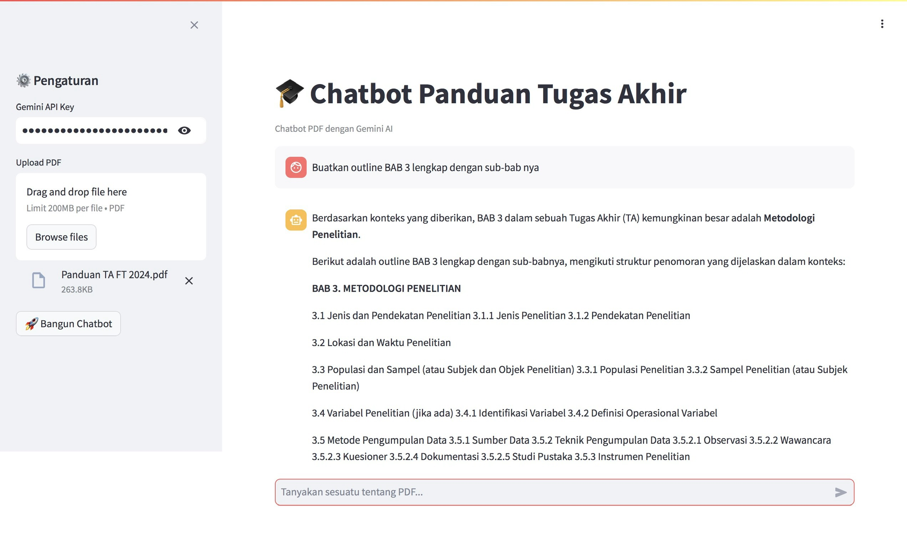

# 🎓 AI PDF Chatbot for Thesis & Academic Guidance

An AI-powered PDF chatbot built with Google Gemini AI and Streamlit.  
This project helps students interact with academic guideline documents such as thesis manuals, final project guides, or research instructions through a conversational interface.

---

## 📌 Project Status

> ⚠️ This repository is currently an **early deployment version / prototype** and is still under active development.

The current version is focused on:
- Learning implementation of AI chatbots
- PDF question-answering workflows
- Gemini AI integration
- Streamlit interface experimentation

Future improvements and new features will continue to be added gradually.

---

## 🚀 Features

- 📄 Upload academic PDF documents
- 💬 Ask questions directly from document content
- 🤖 Powered by Google Gemini AI
- 🧠 Context-aware chatbot interaction
- 🌐 Simple and beginner-friendly Streamlit interface
- ☁️ Deployable from Google Colab

---

## 🛠️ Technologies Used

- Python
- Streamlit
- Google Gemini AI
- LangChain
- FAISS
- PyPDF
- Google Colab

---

## 📂 Project Structure

```bash
Chatbot-Panduan-TA/
│
├── Final Project Chatbot Panduan TA.ipynb
├── README.md
```

---

## ▶️ How to Run the Project

### 1. Open the notebook in Google Colab

Upload or open the `.ipynb` file in Google Colab.

---

### 2. Install required libraries

Run all installation cells inside the notebook.

---

### 3. Generate Gemini API Key

Get your API key from Google AI Studio:
https://aistudio.google.com/app/apikey

---

### 4. Run the notebook cells

Execute all notebook cells sequentially.

---

### 5. Upload PDF document

Upload your thesis guideline or academic document.

---

### 6. Start chatting with the PDF

Ask questions naturally through the chatbot interface.

---

## 📸 Application Preview

### GitHub Repository



---

### Initial Chatbot Interface



---

### Chatbot Response Example



---

## 🎯 Project Goals

This project was created for:
- learning AI chatbot development
- experimenting with Retrieval-Augmented Generation (RAG)
- understanding document-based conversational AI
- supporting academic document accessibility

---

## 🔮 Future Development Plans

Planned improvements include:

- Better UI/UX design
- Multi-PDF support
- Chat history memory
- Faster document retrieval
- Deployment outside Google Colab
- Modular Python application structure (`app.py`)
- Mobile-friendly interface
- Enhanced context intelligence

---

## 🤝 Contributions

Suggestions, feedback, and learning discussions are always welcome.

This project is part of a continuous learning journey in AI and chatbot development.

---

## 👩‍💻 Author

Anna Syahrani

---

## ⭐ Notes

If you find this project useful for learning or experimentation, feel free to fork or star the repository.
